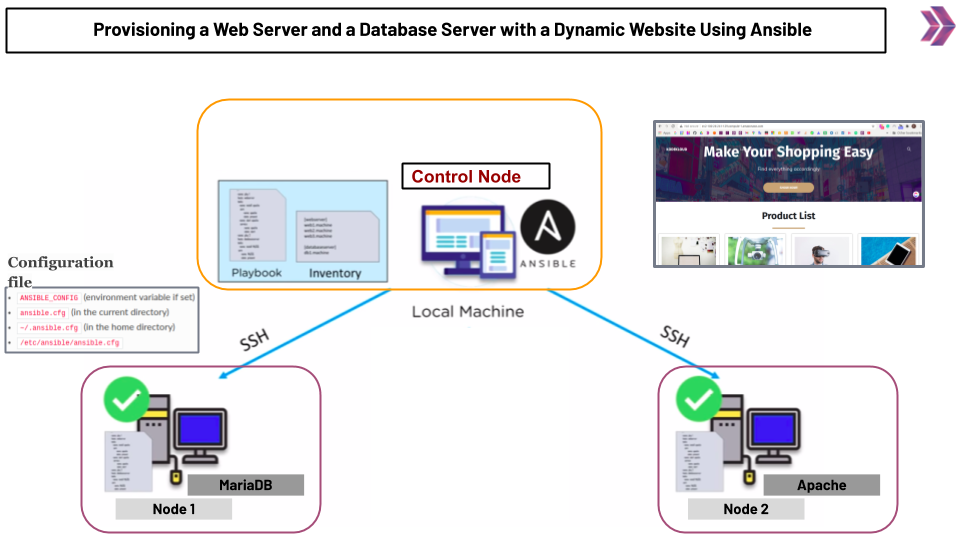

# Ansible Project-01: Provisioning a Web Server and a Database Server with a Dynamic Website Using Ansible

The purpose of this project is to give  the knowledge of provisioning a web and database server with a dynamic website.

## Outline

- Step 1 - Build the Infrastructure (3 EC2 Instances with Red Hat Enterprise Linux 8 AMI)

- Step 2 - Install Ansible on the Controller Node

- Step 3 - Pinging the Target Nodes

- Step 4 - Install, Start and Enable MariaDB 

- Step 5 - Configure User Credentials and Database Schema

- Step 6 - Install, Start and Enable Apache Web Server and Other Dependencies

- Step 7 - Pull the Code from GitHub repo and Make Necessary Changes
